# 2018-ICML-SAC-Technical Scheme and Lab Report

## 2018-ICML-SAC-Introduction 

## 2018-ICML-SAC-Experiment

### Experimental Setup

​	Experiments are conducted in MuJoCo, a high-dimensional and continuous action control benchmark for robotic tasks. Specifically, we evaluate the algorithm on Hopper, Walker2d, Humanoid, Swimmer, HalfCheetah, and Ant, as shown in the following figure:

    <figure style="flex: 1;">
        <video src="./assets/Hopper-v5.mp4" width="90%" controls autoplay loop oncontextmenu="return false;" ondragstart="return false;"></video>
        <figcaption>MuJoCo-Hopper</figcaption>
    </figure>
    <figure style="flex: 1;">
		<video src="./assets/Walker2d-v5.mp4" width="90%" controls autoplay loop oncontextmenu="return false;" ondragstart="return false;"></video>
		<figcaption>MuJoCo-Walker2d</figcaption>
	</figure>
    <figure style="flex: 1;">
        <video src="./assets/Humanoid-v5.mp4" width="90%" controls autoplay loop oncontextmenu="return false;" ondragstart="return false;"></video>
        <figcaption>MuJoCo-Humanoid</figcaption>
    </figure>
    <figure style="flex: 1;">
		<video src="./assets/Swimmer-v5.mp4" width="90%" controls autoplay loop oncontextmenu="return false;" ondragstart="return false;"></video>
		<figcaption>MuJoCo-Swimmer</figcaption>
	</figure>
    <figure style="flex: 1;">
        <video src="./assets/HalfCheetah-v5.mp4" width="90%" controls autoplay loop oncontextmenu="return false;" ondragstart="return false;"></video>
        <figcaption>MuJoCo-HalfCheetah</figcaption>
    </figure>
    <figure style="flex: 1;">
		<video src="./assets/Ant-v5.mp4" width="90%" controls autoplay loop oncontextmenu="return false;" ondragstart="return false;"></video>
		<figcaption>MuJoCo-Ant</figcaption>
	</figure>

The hyperparameter settings for SAC are as follows:

| SAC  Hyperparameters | Value |
| -------------------- | ----- |
|                      |       |
|                      |       |
|                      |       |
|                      |       |
|                      |       |
|                      |       |
|                      |       |
|                      |       |
|                      |       |

### Performance Analysis of SAC

#### Performance Analysis of SAC on MuJoCo

    <figure style="flex: 1;">
        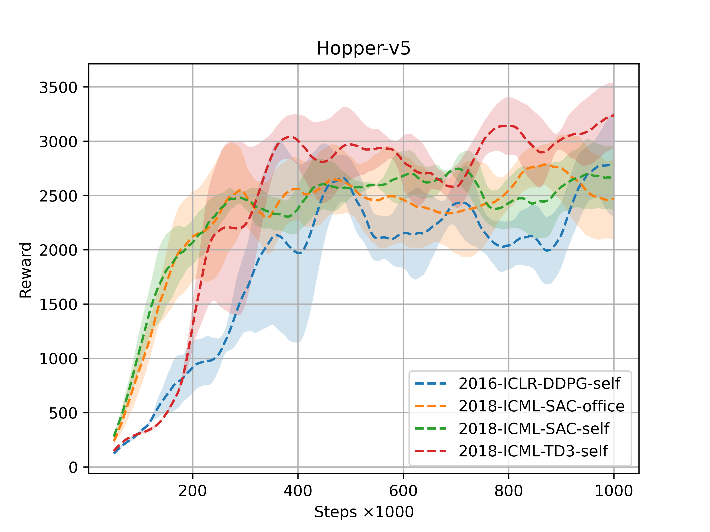
        <figcaption>MuJoCo:Hopper</figcaption>
    </figure>
    <figure style="flex: 1;">
		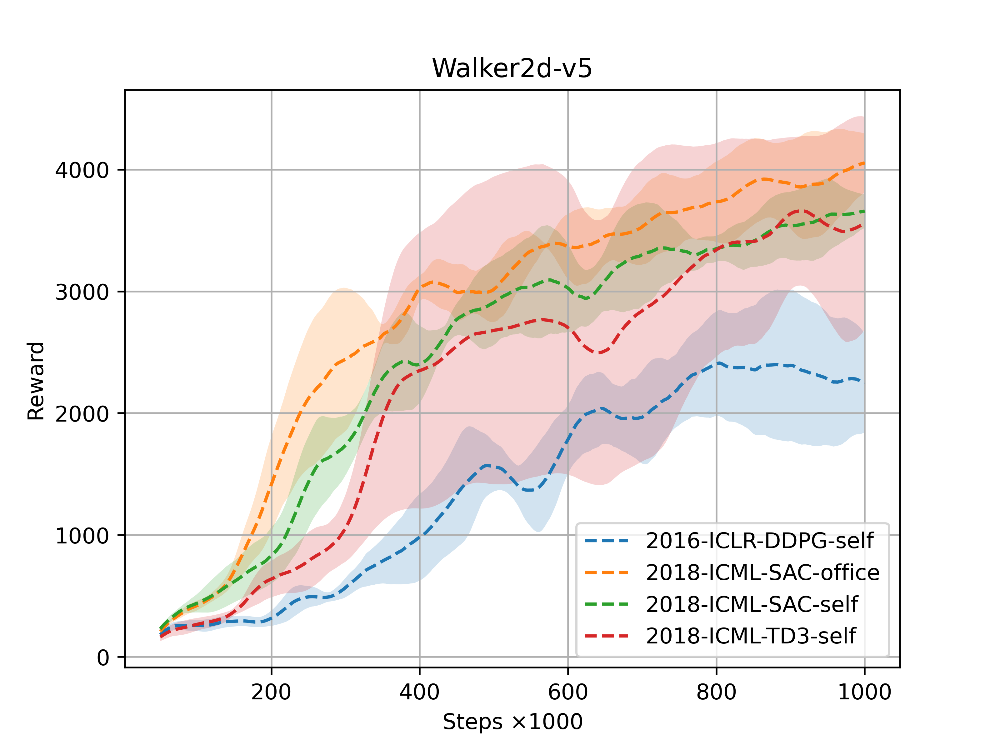
		<figcaption>MuJoCo: Walker2d</figcaption>
	</figure>
    <figure style="flex: 1;">
		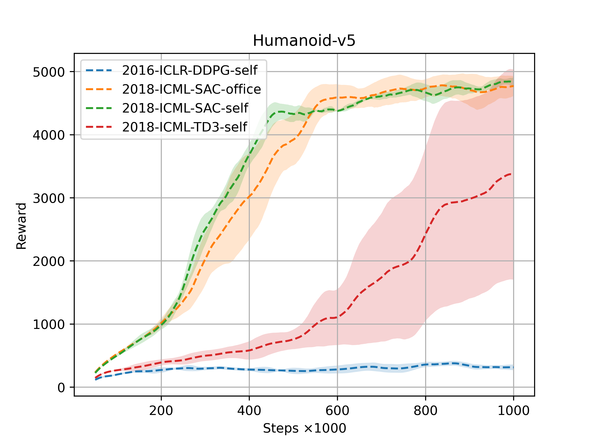
		<figcaption>MuJoCo: Humanoid</figcaption>
	</figure>

    <figure style="flex: 1;">
		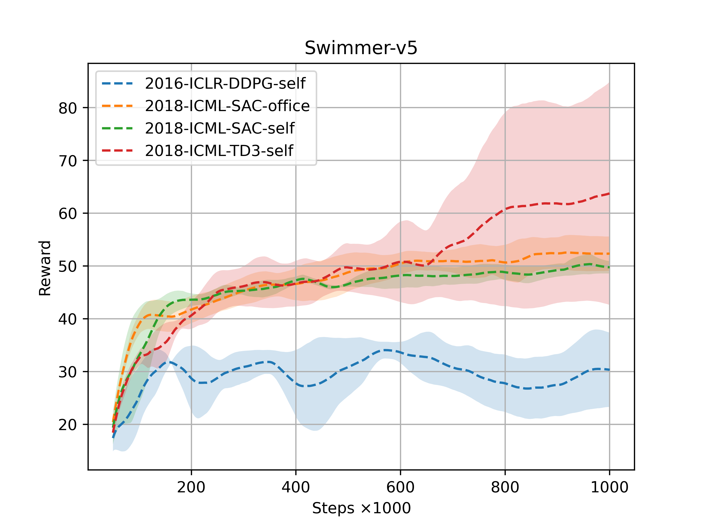
		<figcaption>MuJoCo: Swimmer</figcaption>
	</figure>
    <figure style="flex: 1;">
        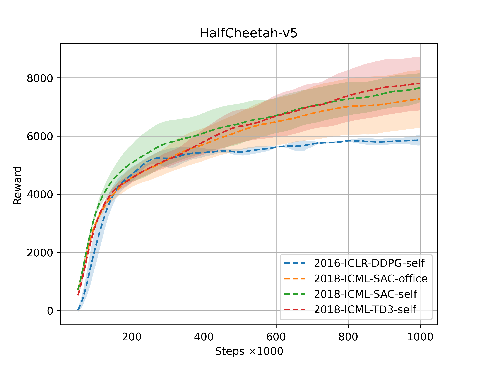
		<figcaption>MuJoCo: HalfCheetah</figcaption>
	</figure>
    <figure style="flex: 1;">
        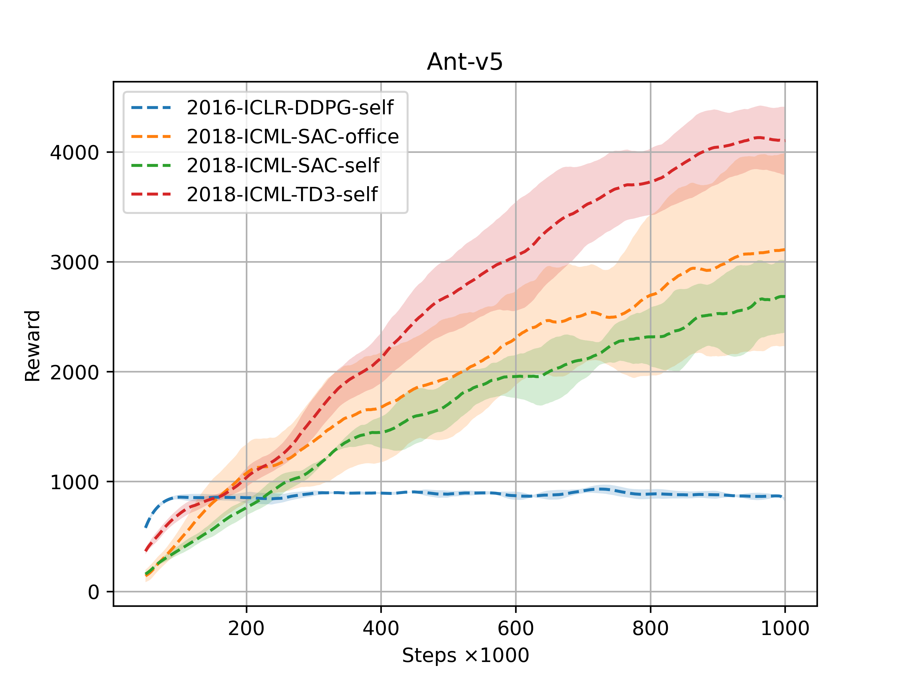
		<figcaption>MuJoCo: Ant</figcaption>
	</figure>

:golf: **Performance Demonstration of SAC-office**

    <figure style="flex: 1;">
        <video src="./assets/Hopper-v5-SAC-office.mp4" width="90%" controls autoplay loop oncontextmenu="return false;" ondragstart="return false;"></video>
        <figcaption>MuJoCo-Hopper SAC-office</figcaption>
    </figure>
    <figure style="flex: 1;">
        <video src="./assets/Walker2d-v5-SAC-office.mp4" width="90%" controls autoplay loop oncontextmenu="return false;" ondragstart="return false;"></video>
        <figcaption>MuJoCo-Walker2d SAC-office</figcaption>
    </figure>
    <figure style="flex: 1;">
        <video src="./assets/Humanoid-v5-SAC-office.mp4" width="90%" controls autoplay loop oncontextmenu="return false;" ondragstart="return false;"></video>
        <figcaption>MuJoCo-Humanoid SAC-office</figcaption>
    </figure>
    <figure style="flex: 1;">
        <video src="./assets/Swimmer-v5-SAC-office.mp4" width="90%" controls autoplay loop oncontextmenu="return false;" ondragstart="return false;"></video>
        <figcaption>MuJoCo-Swimmer SAC-office</figcaption>
    </figure>
    <figure style="flex: 1;">
        <video src="./assets/HalfCheetah-v5-SAC-office.mp4" width="90%" controls autoplay loop oncontextmenu="return false;" ondragstart="return false;"></video>
        <figcaption>MuJoCo-HalfCheetah SAC-office</figcaption>
    </figure>
    <figure style="flex: 1;">
        <video src="./assets/Ant-v5-SAC-office.mp4" width="90%" controls autoplay loop oncontextmenu="return false;" ondragstart="return false;"></video>
        <figcaption>MuJoCo-Ant SAC-office</figcaption>
    </figure>

:grinning: **Performance Demonstration of SAC-self**

    <figure style="flex: 1;">
        <video src="./assets/Hopper-v5-SAC-self.mp4" width="90%" controls autoplay loop oncontextmenu="return false;" ondragstart="return false;"></video>
        <figcaption>MuJoCo-Hopper SAC-self</figcaption>
    </figure>
    <figure style="flex: 1;">
        <video src="./assets/Walker2d-v5-SAC-self.mp4" width="90%" controls autoplay loop oncontextmenu="return false;" ondragstart="return false;"></video>
        <figcaption>MuJoCo-Walker2d SAC-self</figcaption>
    </figure>
    <figure style="flex: 1;">
        <video src="./assets/Humanoid-v5-SAC-self.mp4" width="90%" controls autoplay loop oncontextmenu="return false;" ondragstart="return false;"></video>
        <figcaption>MuJoCo-Humanoid SAC-self</figcaption>
    </figure>
    <figure style="flex: 1;">
        <video src="./assets/Swimmer-v5-SAC-self.mp4" width="90%" controls autoplay loop oncontextmenu="return false;" ondragstart="return false;"></video>
        <figcaption>MuJoCo-Swimmer SAC-self</figcaption>
    </figure>
    <figure style="flex: 1;">
        <video src="./assets/HalfCheetah-v5-SAC-self.mp4" width="90%" controls autoplay loop oncontextmenu="return false;" ondragstart="return false;"></video>
        <figcaption>MuJoCo-HalfCheetah SAC-self</figcaption>
    </figure>
    <figure style="flex: 1;">
        <video src="./assets/Ant-v5-SAC-self.mp4" width="90%" controls autoplay loop oncontextmenu="return false;" ondragstart="return false;"></video>
        <figcaption>MuJoCo-Ant SAC-self</figcaption>
    </figure>

### Hyperparameter Analysis of SAC

#### Learning Rate - Analysis of SAC on MuJoCo

    <figure style="flex: 1;">
        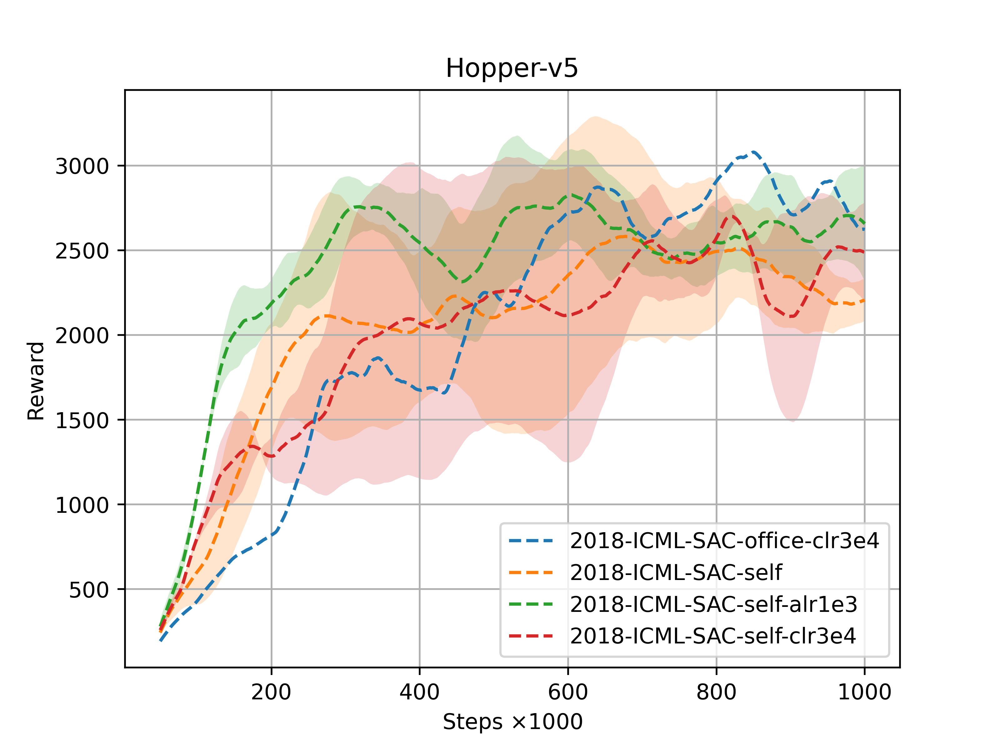
        <figcaption>MuJoCo:Hopper</figcaption>
    </figure>
    <figure style="flex: 1;">
		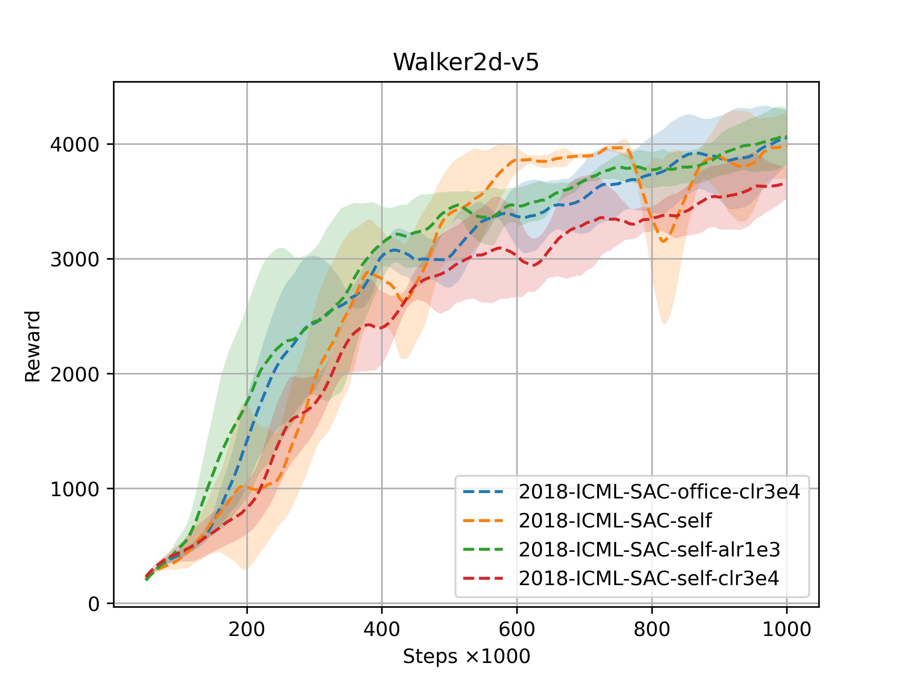
		<figcaption>MuJoCo: Walker2d</figcaption>
	</figure>
    <figure style="flex: 1;">
		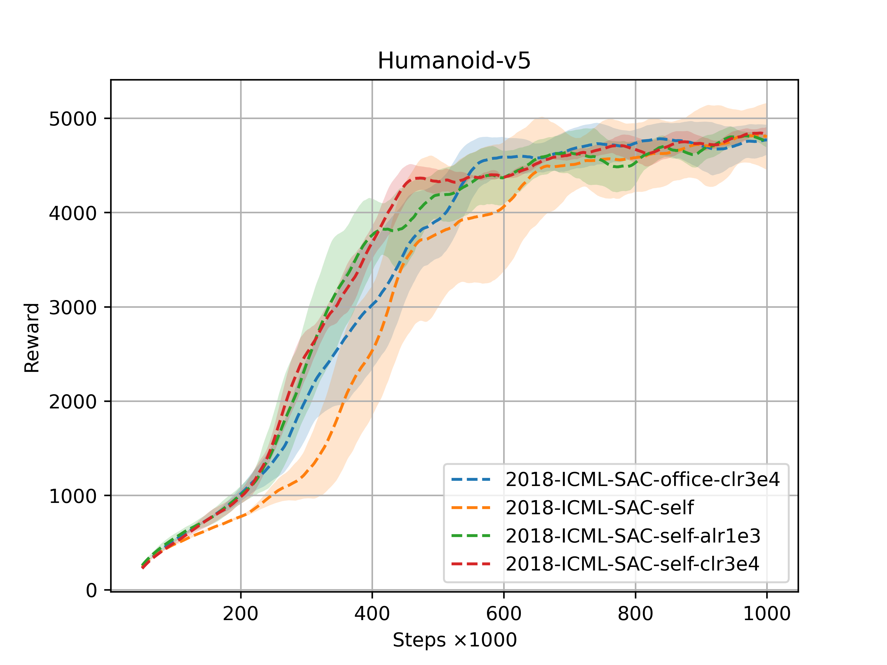
		<figcaption>MuJoCo: Humanoid</figcaption>
	</figure>

    <figure style="flex: 1;">
		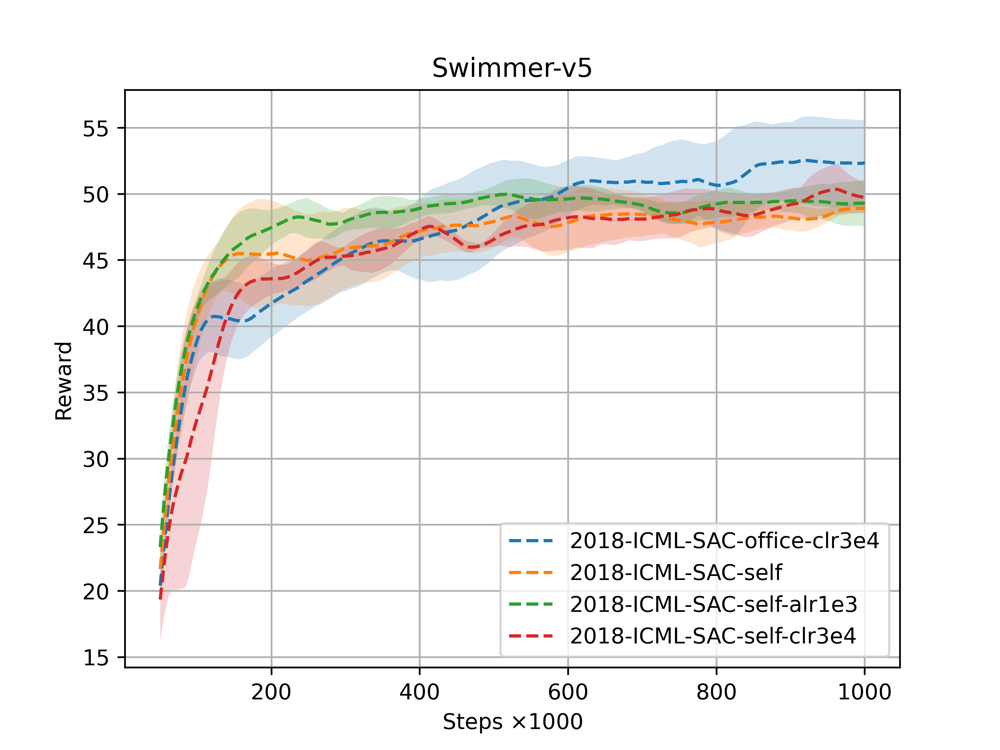
		<figcaption>MuJoCo: Swimmer</figcaption>
	</figure>
    <figure style="flex: 1;">
        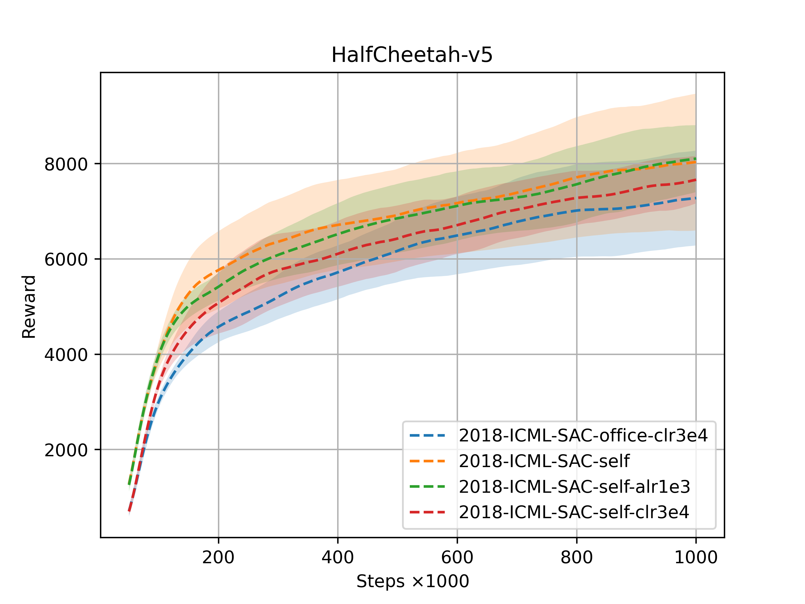
		<figcaption>MuJoCo: HalfCheetah</figcaption>
	</figure>
    <figure style="flex: 1;">
        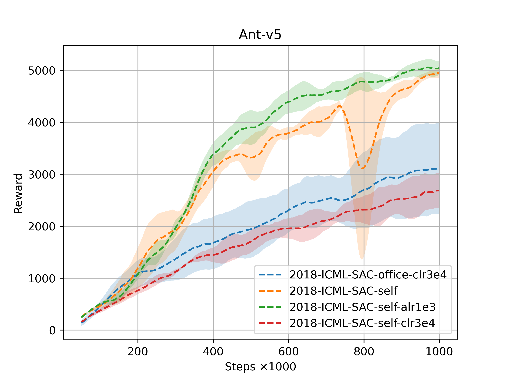
		<figcaption>MuJoCo: Ant</figcaption>
	</figure>

